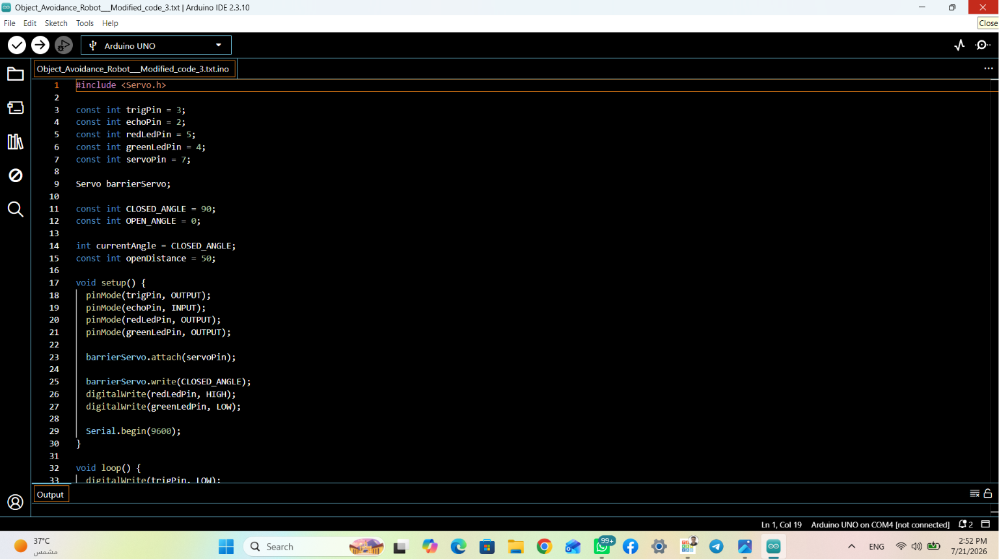

# 🚗 Smart Parking Barrier System

An automated barrier control system built with Arduino, designed to open automatically when an approaching vehicle is detected using an ultrasonic sensor.

---

## 🎥 Project Demo

> 🎬 **Watch the project animation:** [Click here to view GIF Demo](demo.gif)

---

## 🌟 Key Features

* **Automatic Object Detection:** Uses HC-SR04 Ultrasonic sensor to calculate distance in real time.
* **Visual Status Indicators:**
  * 🔴 **Red LED:** Barrier Closed / No Object Detected
  * 🟢 **Green LED:** Barrier Open / Object Detected
* **Smooth Servo Control:** Automatic barrier opening/closing mechanism powered by SG90 Servo motor.

---

## 📸 System Overview

| Barrier Closed | Barrier Open |
| :---: | :---: |
|  |  |

---

## 🔌 Circuit Diagram & Electronics Setup

### Pin Connections:
* **HC-SR04 Ultrasonic Sensor:** 
  * `Trig Pin -> Pin 3`
  * `Echo Pin -> Pin 2`
* **Servo Motor:** 
  * `Signal Pin -> Pin 7`
* **LEDs:**
  * `Red LED -> Pin 5`
  * `Green LED -> Pin 4`

---

## 💻 Arduino Code Overview

* **LinkedIn:** [My LinkedIn Profile](https://linkedin.com/in/ziad-ahmed-819906370)
* **Location:** Cairo, Egypt
